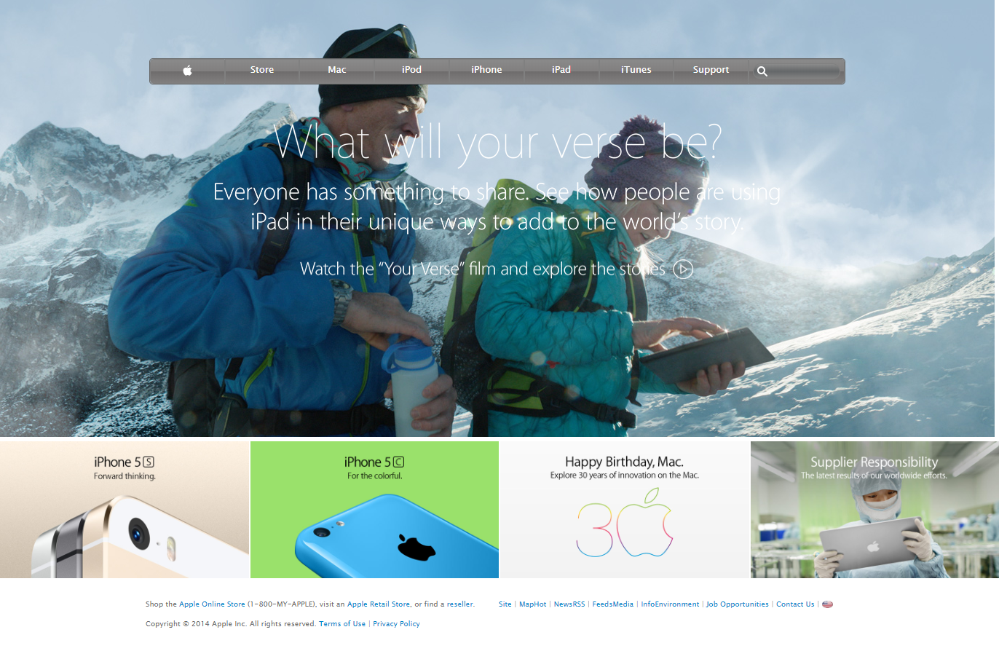

# Apple-clone

> This a clone of the old Apple Website(2014).
> The purpose of this project is to practice building a webpage using images as a background and adding gradients to elements.

> 

## Built With

- HTML &
- CSS
- VS Code Editor

## Live Demo

[Live Demo Link](https://raw.githack.com/glowreeyah/Apple-Clone/feature/index.html)

## Getting Started

To get a local copy up and running follow these simple example steps.

### Prerequisites

A browser of your choice preferrably Chrome.

### Setup

Fork this project to your local machine

## Author

👤 **Glory David**

- Github: [@glowreeyah](https://github.com/glowreeyah)
- Twitter: [@gloweeeyah](https://twitter.com/gloweeeyah)
- Linkedin: [Glorydavid](https://linkedin.com/glory-david)

## 🤝 Contributing

Contributions, issues and feature requests are welcome!

Feel free to check the [https://github.com/glowreeyah/Apple-Clone/issues](issues/).

## Show your support

Give a ⭐️ if you like this project!

## Acknowledgments
- [Apple.com](https://web.archive.org/web/20140301004610/http://www.apple.com/)
- [Shay Howe](https://learn.shayhowe.com/html-css/setting-backgrounds-and-gradients/)

## Pending features
- Improved responsiveness.
- Improved design.
